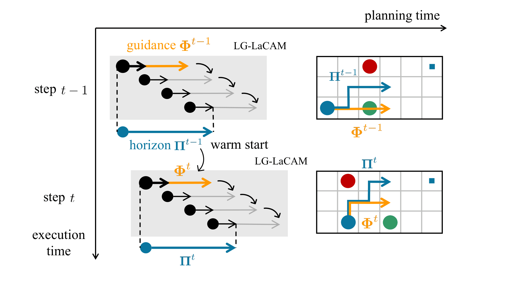

# LLLG: Lifelong LaCAM with Local Guidance for Lifelong MAPF

[](https://arxiv.org/abs/2510.19072)

LLLG is a real-time solver for **Lifelong Multi-Agent Pathfinding (LMAPF)**, extending **LaCAM** with **local guidance** in a receding-horizon lifelong planning framework.
Local guidance supplies each agent with informative spatiotemporal cues that help mitigate congestion, reduce waiting, and improve short-horizon coordination in dense multi-agent environments.
While local guidance has recently shown strong empirical benefits in one-shot MAPF, this work lifts the same idea to the lifelong setting, where agents continuously receive new tasks and must replan under strict real-time constraints. Our method scales effectively and maintains strong performance even in compact, dense environments with many tightly packed agents,
yielding higher throughput and surpassing the prior state-of-the-art, thereby pushing the frontier for real-time lifelong MAPF.

The paper will appear at SoCS-26.

<!-- <p align="center">

</p> -->


<table>
  <tr>
    <td align="center">
       <p><b>LaCAM</b> — The baseline configuration-based LMAPF solver.
      </p>
    </td>
    <td align="center">
       <p><b>LLLG</b> — Lifelong LaCAM with Local Guidance for LMAPF.
      </p>
    </td>
  </tr>
</table>
<p align="center">
  <i>Visualization of 400 agents navigating a multi-room environment.<br> LLLG visibly alleviates local congestion and accelerates overall throughput compared to lifelong LaCAM.</i>
</p>

## Citation
If you find this work to be useful in your research, please consider citing:

```bibtex
@article{arita2025local,
  title={Lifelong LaCAM with Local Guidance for Lifelong MAPF},
  author={Arita, Tomoki and Okumura, Keisuke},
  journal={arXiv preprint arXiv:2510.19072},
  year={2025}
}
```

## Building

All you need is [CMake](https://cmake.org/) (≥v3.16).
The code is written in C++(17).

First, clone this repo with submodules.

```sh
git clone --recursive {this repo}
```

Then, build the project.

```sh
cmake -B build && make -C build -j4
```

## Usage

```sh
build/main -i assets/random-32-32-10-random-1.scen -m assets/random-32-32-10.map -N 400 -v 2 --lg --lg_window 20 --lacam_horizon 10 --lifelong -S 10
```

The result will be saved in `build/result.txt`.

You can find details of all parameters with:

```sh
build/main --help
```

## Visualizer

This repository is compatible with [allegorywrite@mapf-visualizer](https://github.com/allegorywrite/mapf-visualizer).
For example,

```sh
mapf-visualizer assets/random-32-32-10.map build/result.txt --lifelong
```

## Notes

### install pre-commit for formatting

```sh
pre-commit install
```

### simple test

```sh
ctest --test-dir ./build
```
